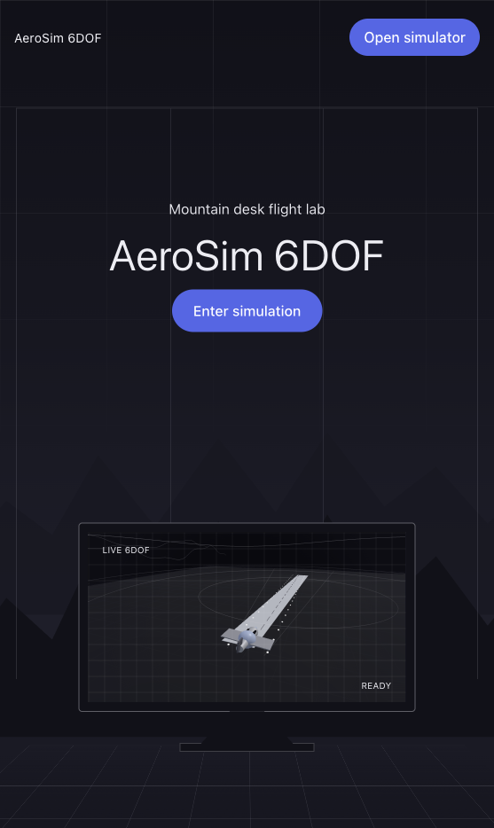
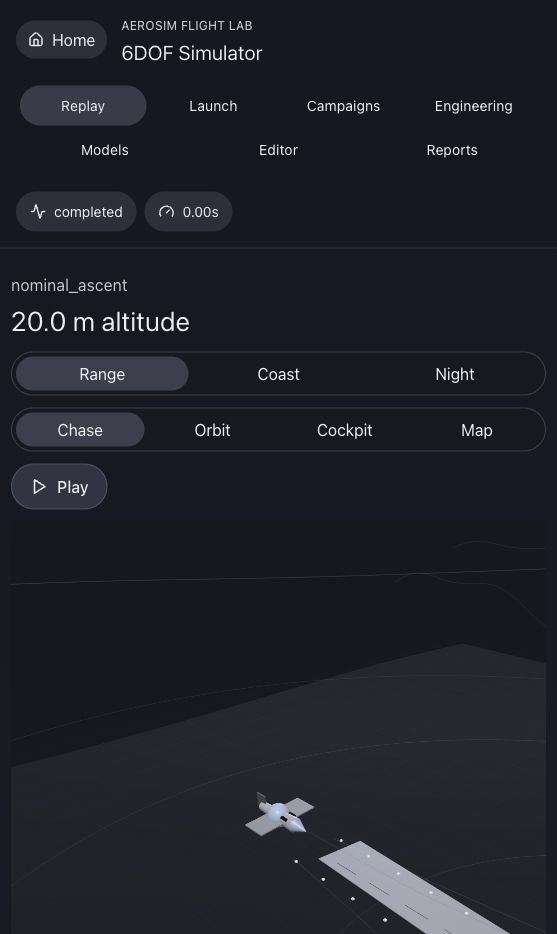
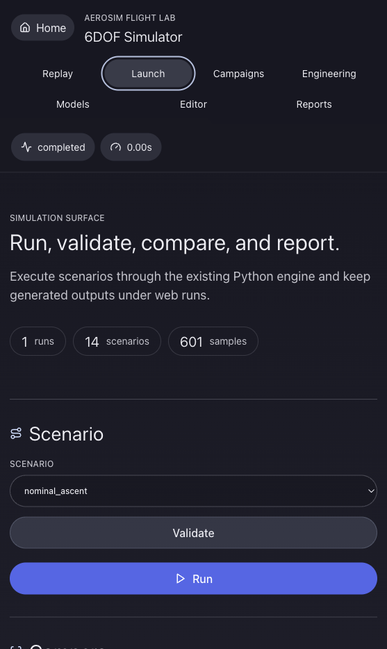

# AeroSim 6DOF

`aerosim6dof` is a compact, inspectable six-degree-of-freedom flight simulation package for early GNC, vehicle concept, mission-performance, and sensor-analysis studies. It models rigid-body translation and rotation, quaternion attitude propagation, atmosphere and gravity variation, winds and gusts, propulsion and mass depletion, aerodynamic force and moment buildup, actuator dynamics, guidance/autopilot loops, sensor measurements, event detection, and report outputs.

The simulation core uses Python and NumPy. The browser dashboard is an optional FastAPI, React, Vite, TypeScript, and Three.js layer that wraps the same engine without replacing the command-line tools.

## Live Simulator

Open the public full-stack simulator at [https://aerosim6dof.onrender.com](https://aerosim6dof.onrender.com). The free Render instance may take about a minute to wake after inactivity. Fresh deployments automatically preload the packaged scenario suite so replay data is available immediately.

| Landing | Replay | Workflows |
| --- | --- | --- |
|  |  |  |

The landing page opens into the browser simulator. The replay view uses generated telemetry from the Python 6DOF engine, while the workflow tabs expose validation, run creation, campaign, engineering, model, editor, and report tools.

### What the Site Is

The live site is a browser front end for the same 6DOF simulation engine used by the command-line tools. It is meant to make the model easier to inspect, share, and use: select a scenario, replay the vehicle in 3D, inspect telemetry, run new cases, generate reports, compare outputs, and explore vehicle/environment assumptions without starting from a terminal.

This is useful when you want to evaluate early flight-vehicle concepts, compare guidance or vehicle settings, test robustness against faults and uncertainty, explain a trajectory to someone visually, or review whether a simulated run stayed within speed, load, dynamic pressure, control, and sensor limits.

### How to Use the Live Simulator

1. Open [https://aerosim6dof.onrender.com](https://aerosim6dof.onrender.com).
2. Click **Enter simulation** or **Open simulator** on the landing page.
3. In **Replay**, choose a preloaded run from the **Run** selector.
4. Use **Play**, the scrubber, and the speed buttons to move through the trajectory.
5. Switch environments, cameras, telemetry groups, and channels to inspect what happened.
6. Use the workflow tabs to generate new runs, campaigns, engineering analyses, model reports, scenario drafts, and downloadable artifacts.

### Main Controls

| Area | What it does |
| --- | --- |
| **Home** | Leaves the workbench and returns to the landing page. |
| **Replay** | Shows the 3D flight replay, current metrics, event timeline, telemetry charts, and artifact links for a selected run. |
| **Run selector** | Switches between preloaded scenarios and newly generated runs. Fresh deployments preload the packaged scenario suite. |
| **Range / Coast / Night** | Changes the replay environment style so the same trajectory can be inspected in different visual contexts. |
| **Chase / Orbit / Cockpit / Map / Range Safety** | Changes the camera mode for following, inspecting, riding with, mapping, or reviewing the engagement geometry from a range-safety perspective. |
| **Play / Loop** | Starts or stops replay playback. |
| **Scrubber** | Moves to an exact telemetry sample in the run. Charts and 3D pose update together. |
| **0.5x / 1x / 2x / 4x** | Changes replay speed. |
| **Trail / Axes / Wind / Velocity / Accel / Sensors** | Toggles trajectory history, body axes, wind, velocity, acceleration, and sensor-frustum visualization overlays. |
| **Trail Color** | Colors the replay trail by speed, qbar, load factor, altitude, or a plain trace. |
| **Telemetry flight / controls / sensors** | Switches chart data between vehicle motion, actuator/control behavior, and sensor outputs. |
| **Add channel** | Adds another telemetry channel to the chart for comparison. Clicking a channel chip removes it. |
| **Launch** | Validates scenarios, runs selected scenarios, compares two runs, builds reports, creates sensor reports, and generates engagement reports. |
| **Campaigns** | Runs batches, Monte Carlo dispersions, parameter sweeps, and fault campaigns. |
| **Engineering** | Runs trim, trim sweeps, linearization, stability analysis, and linear-model reports. |
| **Models** | Inspects vehicle configs, compares vehicles, generates scenario templates, and creates aero, propulsion, and environment reports. |
| **Editor** | Edits scenario drafts through guided fields or raw JSON, validates them, saves drafts, and runs drafts without changing packaged examples. |
| **Reports** | Collects latest results, generated HTML reports, SVG plots, CSV/JSON artifacts, available capabilities, and background job status. |

### Practical Workflows

- **Trajectory review:** choose a run, press **Play**, scrub to key events, and compare altitude, speed, qbar, load factor, controls, and sensor channels.
- **Scenario comparison:** use **Launch** to run or compare two cases, then open the generated report artifacts.
- **Robustness testing:** use **Campaigns** for Monte Carlo samples, parameter sweeps, or fault campaigns to see how sensitive a configuration is.
- **Control and stability checks:** use **Engineering** to trim a vehicle, sweep trim points, linearize a scenario, and inspect stability outputs.
- **Model inspection:** use **Models** to review vehicle, aerodynamic, propulsion, and environment assumptions before trusting a run.
- **Intercept studies:** use **Editor** to add primary and decoy targets plus interceptor definitions, then replay target labels, miss-distance markers, interceptor geometry, and engagement reports.
- **New scenario drafting:** use **Editor** to start from a packaged scenario, adjust duration, initial state, vehicle, environment, guidance, sensors, target/interceptor objects, and event limits, then validate and run the draft.

## Quick Start

```bash
python3 -m unittest discover -s tests
python3 -m aerosim6dof validate --scenario examples/scenarios/nominal_ascent.json
python3 -m aerosim6dof run --scenario examples/scenarios/nominal_ascent.json --out outputs/nominal_expanded
```

Run every packaged scenario:

```bash
python3 -m aerosim6dof batch --scenarios examples/scenarios --out outputs/batch_expanded
```

Run a dispersed Monte Carlo set:

```bash
python3 -m aerosim6dof monte-carlo --scenario examples/scenarios/nominal_ascent.json --samples 25 --seed 77 --mass-sigma-kg 0.2 --out outputs/monte_carlo_nominal
```

Generate a comparison, trim point, linear model, or report:

```bash
python3 -m aerosim6dof compare --a outputs/nominal_expanded/history.csv --b outputs/batch_expanded/gusted_crossrange/history.csv --out outputs/compare
python3 -m aerosim6dof trim --vehicle examples/vehicles/baseline.json --speed 120 --altitude 1000 --out outputs/trim
python3 -m aerosim6dof trim-sweep --vehicle examples/vehicles/baseline.json --speeds 90,120,150 --altitudes 0,1000 --out outputs/trim_sweep
python3 -m aerosim6dof linearize --scenario examples/scenarios/nominal_ascent.json --time 3.0 --out outputs/linearized
python3 -m aerosim6dof stability --linearization outputs/linearized/linearization.json --out outputs/stability
python3 -m aerosim6dof linear-model-report --linearization outputs/linearized/linearization.json --out outputs/linear_model_report
python3 -m aerosim6dof report --run outputs/nominal_expanded
python3 -m aerosim6dof report --run outputs/batch_expanded
```

Inspect models and build subsystem reports:

```bash
python3 -m aerosim6dof inspect-vehicle --vehicle examples/vehicles/baseline.json
python3 -m aerosim6dof inspect-aero --vehicle examples/vehicles/baseline.json
python3 -m aerosim6dof aero-report --vehicle examples/vehicles/baseline.json --out outputs/aero_report
python3 -m aerosim6dof thrust-curve-report --vehicle examples/vehicles/baseline.json --out outputs/propulsion_report
python3 -m aerosim6dof environment-report --environment examples/environments/gusted_range.json --out outputs/environment_report
python3 -m aerosim6dof sensor-report --run outputs/nominal_expanded
python3 -m aerosim6dof engagement-report --run outputs/target_intercept
python3 -m aerosim6dof sweep --scenario examples/scenarios/nominal_ascent.json --set guidance.throttle=0.82,0.86 --out outputs/throttle_sweep
python3 -m aerosim6dof fault-campaign --scenario examples/scenarios/nominal_ascent.json --out outputs/fault_campaign
```

## Browser Dashboard

The web interface provides a full simulator workbench around the existing Python runtime:

- Landing page with a live replay preview in the command-center monitor
- 3D replay scene with range, coast, and night environments
- Chase, orbit, cockpit, map, and range-safety camera modes
- Playback scrubber, speed controls, colored trails, axes, wind, velocity, acceleration, sensor, terrain, target, and interceptor overlays
- Run browser with summary metrics, event timeline, and artifact links
- Telemetry charts for flight, controls, and sensor channels
- Scenario validation, run creation, batch, Monte Carlo, sweep, fault-campaign, trim, linearization, stability, model inspection, and report workflows
- Engagement reports for target/interceptor runs
- Guarded scenario editor with guided mission, target, interceptor, and raw JSON editing

Install the optional web dependencies:

```bash
python3 -m pip install -e ".[web]"
cd web
npm install
cd ..
```

Start the local dashboard:

```bash
./scripts/run_web_demo.sh
```

Then open:

```text
http://127.0.0.1:5174/
```

For a production-style local build, generate the frontend bundle and serve it through FastAPI:

```bash
cd web
npm run build
cd ..
python3 -m aerosim6dof.web.serve --host 0.0.0.0 --port 8000
```

Then open:

```text
http://127.0.0.1:8000/
```

## Deployment

The production deployment is a single web service. The Vite frontend is built into `web/dist`, and the FastAPI app serves that static bundle from the same origin as the `/api` routes. This keeps the replay dashboard, telemetry API, run creation, and artifact links on one public URL.

The included `Dockerfile` builds the frontend and installs the Python web API. The included `render.yaml` is a ready-to-use Render Blueprint for a Docker web service.

Build and test the production container locally:

```bash
docker build -t aerosim6dof .
docker run --rm -p 10000:10000 -e PORT=10000 aerosim6dof
```

Then open:

```text
http://127.0.0.1:10000/
```

Health check:

```bash
curl http://127.0.0.1:10000/api/health
```

Generated browser runs are written under `outputs/web_runs`. Use a persistent disk mounted at `/app/outputs` in hosted environments if generated runs need to survive redeploys.

## Outputs

Each run directory contains:

- `history.csv`: combined truth, controls, environment, aero, guidance, and sensor channels
- `truth.csv`: state, atmosphere, wind, aerodynamic, propulsion, and energy channels
- `controls.csv`: commands, achieved deflections, throttle, saturation, and failure flags
- `sensors.csv`: IMU, GPS, barometer, pitot/static, and magnetometer measurements
- `targets.csv`: target object kinematics, labels, roles, range, range-rate, and closest-approach channels when a scenario includes targets
- `interceptors.csv`: interceptor launch/fuze state, target assignment, range, closing speed, and best-miss channels when a scenario includes interceptors
- `events.json`: burnout, apogee, qbar/load exceedance, actuator saturation, target crossing, ground impact, and max-altitude events
- `summary.json`: final state and envelope metrics
- `scenario_resolved.json`: scenario after inheritance and config merges
- `manifest.json`: version, run settings, sample count, and artifact inventory
- `report.html`: self-contained run report linking the SVG plots
- `engagement_report.html`: target/interceptor engagement summary for runs with engagement objects
- `plots/*.svg`: a rich set of trajectory, attitude, loads, controls, sensor, and envelope plots

Batch and Monte Carlo runs additionally write aggregate index CSV files and HTML dashboards:

- `batch_index.csv` and `batch_report.html`
- `monte_carlo_index.csv`, `monte_carlo_summary.json`, and `monte_carlo_report.html`
- `fault_campaign_index.csv`, `fault_campaign_summary.json`, and `fault_campaign_report.html`
- `sensor_report/sensor_metrics.json`, `sensor_report/sensor_metrics.csv`, and `sensor_report/sensor_report.html`

## Packaged Scenarios

The examples include nominal ascent, gusted crossrange, actuator saturation, stuck elevator, thrust misalignment, high-altitude low-density flight, noisy-sensor autopilot, GPS dropout navigation, IMU bias navigation, target intercept, engine thrust loss, high-angle-of-attack stall, waypoint navigation, and glide-return cases. Scenarios can inherit reusable vehicle and environment files from `examples/vehicles/` and `examples/environments/`.

## Project Layout

```text
aerosim6dof/
  core/          Quaternion, rotation, interpolation, integration, and unit helpers
  environment/   Atmosphere, gravity, wind, turbulence, and terrain models
  vehicle/       State, mass properties, geometry, propulsion, aero, actuators, failures
  gnc/           Guidance, autopilot, controllers, allocation, navigation, trim
  sensors/       IMU, GPS, barometer, pitot, magnetometer, radar, optical flow, horizon
  simulation/    Dynamics, events, runner, logging, Monte Carlo and fault campaigns
  analysis/      Metrics, envelopes, validation, comparison, subsystem reports
  reports/       CSV, JSON, SVG, and HTML writers
  web/           FastAPI browser API, run indexing, jobs, and artifact access
examples/
docs/
tests/
web/             React, Vite, TypeScript, and Three.js dashboard
```

## Extending

Add a scenario JSON under `examples/scenarios/`, point it at a vehicle and environment config, and override only the sections that need to change. The default models are intentionally readable: aerodynamic derivatives, thrust curves, actuator failures, wind events, sensor noise, guidance modes, event limits, and integrator choice are all scenario-configurable.

See `docs/` for model assumptions, scenario fields, vehicle modeling guidance, sensor references, output channel definitions, validation notes, and known limitations.
